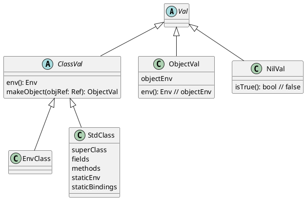

# OBJ Implementation

## Libraries



## Defining a class

```OBJ
define A = class extends B
    static x = 3
    static foo = proc() 0
    field y
    method bar = proc() 1
end
```

### Syntax

```BNF
<exp>:ClassExp   ::= <classDecl>
<classDecl>      ::= CLASS <ext> <statics> <fields> <methods> END
<ext>:Ext1       ::= EXTENDS <exp>
<ext>:Ext0       ::=
<statics>        **= STATIC <VAR> EQUALS <exp>
<fields>         **= FIELD <VAR>
<methods>        **= METHOD <VAR> EQUALS <proc>
```

### Semantics

A ClassExp evaluates to a StdClass.

```java
    // Called by ClassExp.eval(env)     
    public StdClass(
            Env localEnv,        // the environment where this class is created
            ClassVal superClass, // evaluated by ClassExp
            Statics statics,     // static variable definitions
            Fields fields,       // field declarations
            Methods methods) {   // method definitions
        this.superClass = superClass;
        this.fields = fields;
        this.methods = methods;
        // this class's static environment extends the superclass environment
        staticEnv = superClass.env();
        this.staticBindings = new Bindings(); // all statics go here
        this.staticEnv = staticEnv.extendEnvRef(staticBindings);
        // initially create bindings for these static symbols ...
        Ref ref = new ValRef(new ObjectVal(localEnv));
        this.staticEnv.add(new Binding("!@", ref)); // not a var
        this.staticEnv.add(new Binding("myclass", new ValRef(this)));
        this.staticEnv.add(new Binding("superclass", new ValRef(superClass)));
        // The static RHS expressions are evaluated in the modified
        // staticEnv that includes the bindings for !@, myclass, superclass.
        // New static bindings are added as they are created,
        // as in top-level defines
        statics.addStaticBindings(staticEnv);
    }
```

Statics addStaticBindings method.

```java
Statics
%%%
   // Add new bindings to the static bindings -- behaves like top-level
    // defines.
    public void addStaticBindings(Env env) {
        Iterator<Token> varIter = varList.iterator(); // LHS identifiers
        Iterator<Exp> expIter = expList.iterator();    // RHS expressions
        while(varIter.hasNext()) {
            Token var = varIter.next();
            String id = var.toString(); // the LHS identifier
            Exp exp = expIter.next();    // the RHS expression
            Val val = exp.eval(env);
            Ref ref = new ValRef(val);
            env.add(new Binding(id, ref));
        }
    }
%%%
```

## Accessing members

```OBJ
<A>x
```

### Syntax

```BNF
<exp>:EnvExp     ::= LANGLE <exp>vExp RANGLE <exp>eExp
```

### Semantics

```java
EnvExp
%%%
    public Val eval(Env env) {
        Val v = vExp.eval(env);
        return eExp.eval(v.env());
    }
%%%
```

## Object creation

```OBJ
new A
```

### Syntax

```BNF
<exp>:NewExp     ::= NEW <exp>
```

### Semantics

```java
NewExp
%%%
    public Val eval(Env env) {
        // get the class from which this object will be created
        Val val = exp.eval(env);
        // create a reference to a dummy value (nil)
        Ref objRef = new ValRef(Val.nil);
        // let the class create the object
        ObjectVal objectVal = val.makeObject(objRef);
        // set the reference to the newly created object
        return objRef.setRef(objectVal);
    }
%%%
```

```java
class EnvClass extends ClassVal {
    ...
    public ObjectVal makeObject(Ref objRef) {
        // start with the static environment of this class
        Env env = this.staticEnv;
        // add the field binding 'self' to refer to the base object (deep)
        Bindings fieldBindings = new Bindings();
        env = env.extendEnvRef(fieldBindings); // this object's environment
        fieldBindings.add("self", objRef);                // deep
        return new ObjectVal(env);
    }
    ...
}
```

```java
class StdClass extends ClassVal {
    ...
    public ObjectVal makeObject(Ref objRef) {
        ObjectVal parent = superClass.makeObject(objRef);
        Env env = parent.objectEnv;
        env = env.extendEnvRef(this.staticBindings);
        Bindings fieldBindings = new Bindings();
        env = env.extendEnvRef(fieldBindings);
        fields.addFieldBindings(fieldBindings); // init to Nil
        env = methods.addMethodBindings(env); // as in letrec
        ObjectVal objectVal = new ObjectVal(env);
        fieldBindings.add("super", new ValRef(parent)); // parent object
        fieldBindings.add("self", objRef); // deep
        fieldBindings.add("this", new ValRef(objectVal)); // shallow
        return objectVal;
    }
    ...
}
```
