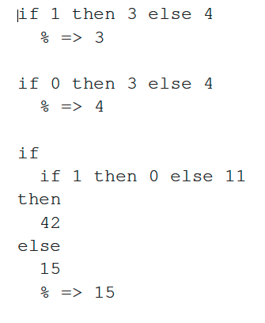

# Q&A for V2-V3


* Are there ways to specify optional tokens in PLCC that would allow for stuff like brackets or curly braces in if blocks or let blocks, just to make the scope of them more clear if the user wanted to do that with their expressions?

Assuming you are talking about the language we write grammar files in,
you have whitespace, comments that start with #, and when you are inside
a Java block (`%%%` java block `%%%`) then you have whatever Java allows.

If you are talking about the `V` languages, then you only have whitespace.
Later we'll get curly braces. But for now, we must use whitespace to
convey our intension.


* I'm having a lot of difficulty understanding how to evaluate the expressions on slide 3.42. These are similar to the first question on this quiz of which I also struggled with.



Here is how to evaluate an `IfExp`:

1. Evaluate the expression after the `IF`.
2. If the result is 0, then evaluate the expression after `ELSE` and that is the result of the `IfExp`.
3. Otherwise, evaluate the expression after the `THEN` and that result is the result of the `IfExp`.

The third example has a nested `IfExp`. But it's unusual because the
nested `IfExp` is in the "test" expression. Let's evaluate the entire
expression to see how it works.

1. When we get to the outer `IfExp` we must evaluate the expression after
    the `IF`, which itself is an `IfExp`. OK, let's do it.
    1. We evaluate the expression after the `IF`, which is `1`.
    2. This is not `0` so we evaluate expression after the `THEN`, which
        which is `0` and that's the result of the inner `IfExp`.
2. Returing to the outer `IfExp`, the "test" expression's result is `0`.
    So we evalaute the expression after the `ELSE`, which is `15`, and
    that's the result of the outer `IfExp`.


* What does it mean to "extend the enclosing environment"? Does this mean we are adding another environment to the linked list of environments?

Every expression is evaluated within an environment. That environment
is that expression's enclosing environment. To extend it means to create
a new set of bindings and add a new Env node that contains those bindings
and that points to the enclosing Env node.

* Slides 3.46 and 3.50 discuss the inability of our language to modify the value bound to a variable, but also mentions scope plays a factor in this. This is confusing to me, for I don't understand when a variable can be "redefined" as a new value and when it keeps its original value it was bound to.

Right now, we don't have variables. We have bindings. A binding is a
symbol and a value. Once a binding is created, there is no way to change
the value invovled in that binding. Now it is possible to create a new
binding that happens to have the same symbol as another binding, but
that's a different binding.

```
let
    x = 3   % This x is forever bound to 3.
in
    +
    (   let
            x = 4   % This is a different x. It is forever bound to 4.
        in
            x   % inner let; so 4
    ,   x   % outer let; so 3
    )
% 7
```

Notice how the scope determines which x we are refering to, but also notice that both bindings exist within the inner let; we just don't have any way to access the outer x in the BODY of the inner let.
