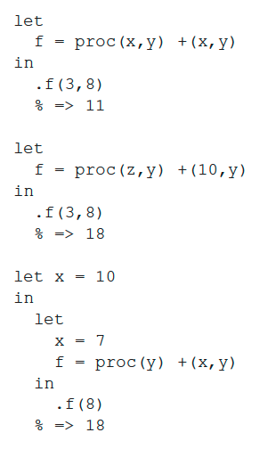

* If every let structure can be rewritten as expressions such as .proc(v1,v2,...) is let only used for readability in these scenarios?

`ProcExp` evaluates to a `ProcVal` that can be passed around. `LetExp` cannot.
So there is a difference in what you can do with them. However, they have an
equivalence in evaluation. So anything you can do with a `LetExp` you can do
with `ProcExp` and `AppExp`, but not the other way.

* Is the larger value preferred over the smaller value? For example the second algorithm on slide 3.53 which has .f(3,8). Is the 3 ignored for the 10 or is there a different reason why 10 is used instead.

I think you are refering to 3.54.

However, I'm not sure about your question. Let's review this during class.

* Could we do a step-by-step walkthrough of the Factorial recursion on slide 3.56? I'm not sure that I can fully trace through what is happening, though I think I get the big picture.
* "let app = proc(f,x) .f(x) " in 3.55
* Everything from 3.55 on is a bit confusing as well and I would like to see it in class.
* Wow, this reading was very dense. I read it about three times, hoping to grasp it a little better but it was very difficult. On the very first slide (3.51) I struggled with understanding how the expression evaluates to 4. It would be useful to do this on the board, using the environment and their bindings' illustrations we have been making- they are extremely helpful!

Yes, yes, yes! Let's work them out on the board!
